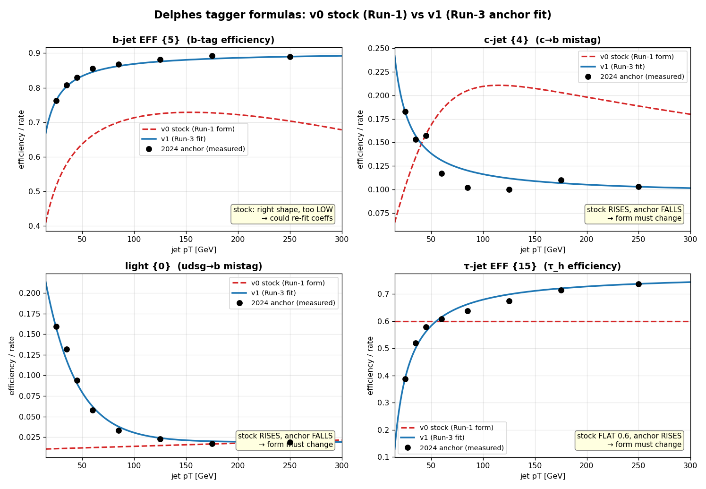

# Delphes card v0 → v1: Run-3 tagger baselines (summary)

**What changed.** The stock CMS Delphes card carries Run-1-era (CSV, arXiv:1211.4462)
b/c/light tagging formulas and a pre-DeepTau flat τ efficiency. `cms_card_v1.tcl`
replaces the **BTagging** (PATCH-6) and **TauTagging** (PATCH-7) blocks with fits to
the **2024 NanoAODv15 (kl=1) anchor** measurement — the same per-jet efficiencies the
downstream tuning uses. Nothing else in the card changes (`ExecutionPath`, resolutions,
`JetFlavorAssociation`, `TreeWriter`, all other modules are byte-identical).

**`cms_card_v0.tcl` is kept frozen** as the provenance of the already-produced `/ceph`
samples; use v1 for new productions. Validation auto-selects the closure targets from
the config's `card:` path (`card_formulas.for_card`).

## Formulas (per-jet efficiency vs pT)

| PDG `{code}` | quantity | v0 stock (Run-1) | v1 (Run-3 anchor fit) |
|---|---|---|---|
| `{5}` | b-tag eff | `0.85·tanh(0.0025·pt)·25/(1+0.063·pt)` | `(pt>4)·(0.904 − 3.53/pt)` |
| `{4}` | c→b mistag | `0.25·tanh(0.018·pt)·1/(1+0.0013·pt)` | `0.094 + 2.22/pt` |
| `{0}` | light→b mistag | `0.01 + 0.000038·pt` | `0.019 + 0.32·exp(−pt/30)` |
| `{15}` | τ_h eff | `0.6` (flat) | `(pt>12.5)·(0.776 − 9.7/pt)` |
| `{0}` | jet→τ_h fake | `0.01` | `0.004` |
| — | TauTagging `DeltaR` | `0.5` | `0.4` (matches AK4 + downstream re-tag) |

## Why the functional forms changed (not just numbers)

For the b-jet the stock *shape* is right (rises→plateau) and only the level is low — a
coefficient re-fit would have sufficed. But for **c, light, and τ** the stock form has
the **wrong pT trend**, so no renumbering reproduces the measurement:

| quantity | stock trend | anchor trend | form change needed? |
|---|---|---|---|
| b-jet eff | rises→plateau ~0.72 | rises→plateau ~0.89 | no (level only) — v1 form is a choice |
| c→b mistag | **rises** 0.07→0.21 | **falls** 0.18→0.10 | **yes** — opposite trend |
| light→b mistag | **rises** 0.011→0.019 | **falls** 0.16→0.019 | **yes** — opposite trend |
| τ_h eff | **flat** 0.60 | **rises** 0.39→0.74 | **yes** — a constant can't turn on |

The Delphes formula is only a **smooth interpolant through the measured points** — the
physics content is the anchor (black points below), not the algebraic form. Fit quality:
max |fit − anchor bin| ≤ 0.018 (b 0.010, c 0.018, light 0.013, τ 0.025).

*(regenerate with `python scripts/plot_tagger_v0_vs_v1.py`)*

## Caveat (accepted)

The anchor is the **bb̄ττ signal**, so the light-mistag and jet→τ_h fake rate are
environment-dependent (busy, b-rich; the low-pT light mistag sits well above the
inclusive-tt̄ WP definition). Fake-dominated backgrounds (QCD, W+jets) take per-jet fake
weights downstream, not the card bits — re-derive those maps on the background samples
before trusting them. The card baseline exists so the downstream stochastic re-tag is a
small correction, not a rescue.

## Files

- Card: [`cards/cms_card_v1.tcl`](../cards/cms_card_v1.tcl) (v0 frozen at [`cards/cms_card_v0.tcl`](../cards/cms_card_v0.tcl))
- Patch: [`docs/cms_card_v0_to_v1.patch`](cms_card_v0_to_v1.patch) — `git apply` / `patch -p1`
- Closure transcription + dispatch: `validation/references/card_formulas.py` (`expected_v1`, `for_card`)
- Detailed patch justification (all of PATCH-1…7): [`docs/card_patch_validation.md`](card_patch_validation.md)
- Tests: `tests/test_card_v1.py` (anchor fit, dispatch, tcl↔python lockstep, card-aware closure)
